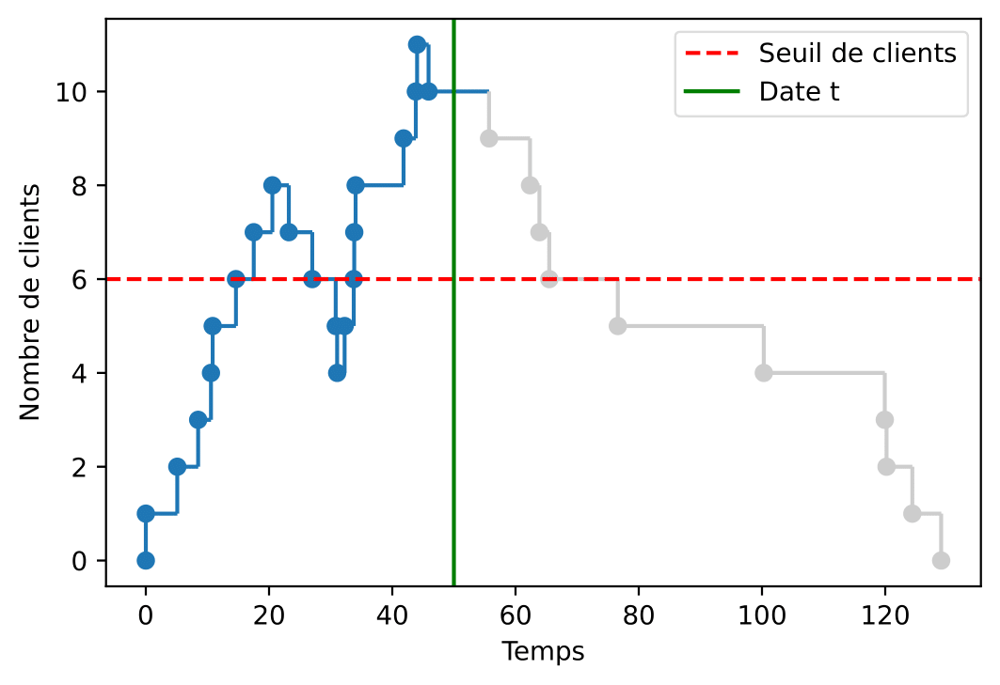

# MCM_ensae
 

Simulation d'une file d'attente et probabilité que le nombre de clients dans la file dépasse un certain seuil.

- [0_file_attente.ipynb](https://nbviewer.jupyter.org/github/baptiste-pasquier/MCM_ensae/blob/main/0_file_attente.ipynb) : Modélisation de la file d'attente, estimation de la probabilité, étude de l'influence des paramètres, quasi-Monte Carlo.
- [1_ABC.ipynb](https://nbviewer.jupyter.org/github/baptiste-pasquier/MCM_ensae/blob/main/1_ABC.ipynb) : Estimation par une méthode ABC des paramètres d'une file d'attente en observant les sorties des clients.
- [2_Weibull.ipynb](https://nbviewer.jupyter.org/github/baptiste-pasquier/MCM_ensae/blob/main/2_Weibull.ipynb) : Etude avec des lois de Weibull.

[Slides](slides.pdf)

-----------------

## Installation

* Installation de l'environnement Anaconda

Cloner le répertoire puis exécuter à l'intérieur du répertoire : 
```bash
conda env create
```

* Lancement de JupyterLab ou Jupyter Notebook

Exécuter à l'intérieur du répertoire : 
```bash
conda activate mcm
jupyter lab
```
ou : 
```bash
conda activate mcm
jupyter notebook
```

-----------------

2021
